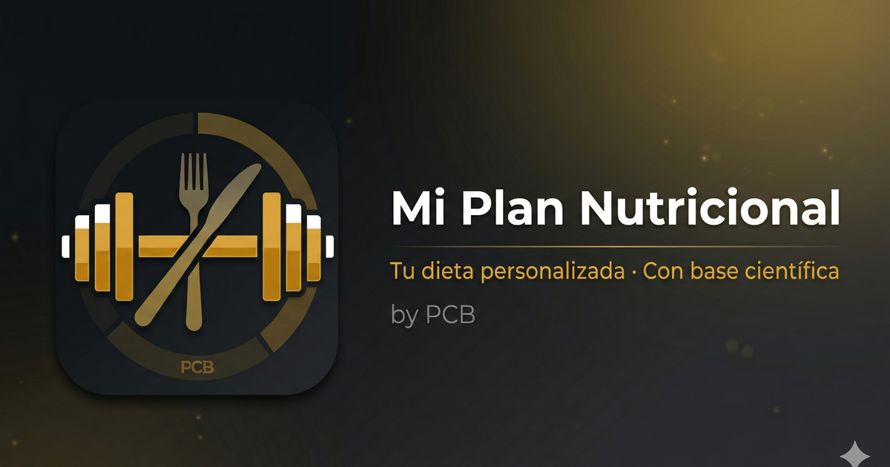

# 🍽️ Mi Plan Nutricional

**Planificador de dieta personal** con cantidades auto-ajustadas, calculadora de gasto calórico y suplementación basada en evidencia científica.

## 👉 [Abrir la app](https://pcresp0.github.io/dieta_gym_PCB/)

<p align="center">
  
</p>

---

## Funcionalidades

### 🎚️ Selector de calorías
- Rango de **1500 a 3500 kcal** en pasos de 100
- Slider visual + botones +/−
- Todas las cantidades se recalculan al instante

### 🍳 Planificación de comidas
- **6 opciones de desayuno** con tarjetas seleccionables (yogur/QFB, tostadas, cereales, tortitas, yogures proteicos, bocadillo)
- **Almuerzo y cena** con tablas de hidratos y proteínas (elige 1 de cada)
- **Extras obligatorios** por comida: ~200g verduras + 15ml AOVE + 1 fruta
- Gramajes escalados automáticamente según las kcal elegidas

### 📊 Resumen nutricional
- Calorías totales con desglose base (extras obligatorios) vs. elegido
- Barras de macros a **dos colores**: segmento base + segmento selección
- Porcentajes de proteínas, carbohidratos y grasas
- Leyenda visual para diferenciar cada componente

### 🧮 Calculadora TDEE
- Fórmula de **Mifflin-St Jeor** (TMB)
- Factor de actividad diaria (sedentario → muy activo)
- Configuración de entreno: tipo, días/semana, duración, intensidad
- Barra visual de **déficit / mantenimiento / superávit**
- Recomendación calórica según objetivo (perder grasa, mantener, ganar masa)
- Tooltips informativos con explicación de cada concepto

### 💊 Suplementación
- Dosis exactas basadas en productos específicos (ESN)
- **Creatina** monohidrato: 5g/día
- **Omega-3** (ESN): 3 cáps/día → 1200mg EPA + 900mg DHA
- **Magnesio** (ESN Complex): 3 cáps/día (complejo 4-en-1)
- **Zinc** (ESN): 1 cáp/día → 25mg
- **Melatonina**: 6-10mg pre-sueño
- Tooltips con evidencia científica (ISSN, meta-análisis)

### 🏋️ Modo Entrenador (oculto)
- Acceso secreto: mantener pulsado "Mi Plan Nutricional" 1.2s
- Muestra el plan fijo a 2500 kcal con gramajes exactos del entrenador
- Invisible para usuarios comunes

### ⚙️ Onboarding personalizado
- Wizard de configuración inicial en 4 pasos
- Calcula automáticamente las kcal recomendadas
- Permite elegir objetivo: perder grasa / mantener / ganar masa

### 🎨 Otros
- **Tema claro/oscuro** con toggle
- **Responsive**: optimizado para móvil y escritorio
- **Persistencia**: todo se guarda en localStorage
- **Barra de validación** que indica qué falta por seleccionar
- **Avisos calóricos** cuando te alejas mucho de lo recomendado
- **Contador de visitas** en el footer

---

## Arquitectura

Single Page Application estática — **sin backend, sin frameworks, sin dependencias**.

```
dieta_gym_PCB/
├── index.html              ← Estructura HTML (onboarding + app + modales)
├── css/
│   └── styles.css          ← ~2500 líneas: variables CSS, grid, flexbox, responsive
├── js/
│   └── app.js              ← ~800 líneas: datos, lógica, renderizado, persistencia
├── img/
│   ├── og-image.png        ← Open Graph para compartir
│   ├── favicon.png         ← Favicon 192x192
│   └── apple-touch-icon.png
├── Fundamentos_Nutricionales.md  ← Documento científico de referencia
└── README.md
```

### Stack

| Tecnología | Uso |
|---|---|
| HTML5 | Estructura semántica, meta tags OG, PWA-ready |
| CSS3 | Variables, Grid, Flexbox, `@media`, temas con `data-theme` |
| JavaScript (ES5 compatible) | Lógica, datos, renderizado dinámico — 0 dependencias |
| localStorage | Persistencia de estado (selecciones, calculadora, tema) |
| GitHub Pages | Hosting estático gratuito |

### Cómo funciona

**Escalado de cantidades:**
```
ratio = kcal_seleccionadas / 2500
cantidad = redondear_a_5(cantidad_base × ratio)
```

**Cálculo TDEE (Mifflin-St Jeor):**
```
TMB♂ = (10 × peso) + (6.25 × altura) − (5 × edad) + 5
TMB♀ = (10 × peso) + (6.25 × altura) − (5 × edad) − 161
NEAT  = TMB × factor_actividad
TDEE  = NEAT + (kcal_entreno × días/semana ÷ 7)
```

**Renderizado:** Todo se genera dinámicamente desde arrays de datos en JS. Cada cambio dispara un re-render selectivo de las secciones afectadas.

**Persistencia:** `localStorage` con claves `dietAppV2` (estado app), `dietAppCalc` (calculadora), `dietTheme` (tema).

---

## Base científica

Las recomendaciones de suplementación y los cálculos se basan en:

- **ISSN** (International Society of Sports Nutrition) — Position Stands
- **Mifflin-St Jeor** (1990) — Fórmula de TMB más precisa para población general
- **Jäger et al. 2017** — Creatina: 3-5g/día crónicos
- **ISSN 2024** — Omega-3: 2-3g EPA+DHA para reducir DOMS
- **Dominguez et al. 2025** — Magnesio orgánico: cofactor ATP, calidad sueño

Documento completo: [`Fundamentos_Nutricionales.md`](Fundamentos_Nutricionales.md)

---

## Desarrollo local

```bash
git clone https://github.com/pCresp0/dieta_gym_PCB.git
cd dieta_gym_PCB
python3 -m http.server 8080
open http://localhost:8080
```

Sin `npm install`, sin build, sin dependencias. También puedes abrir `index.html` directamente.

---

## Autor

**Pablo Crespo** · [LinkedIn](https://www.linkedin.com/in/pablocrespobellido/) · [GitHub](https://github.com/pCresp0)

---

<p align="center">
  
</p>
